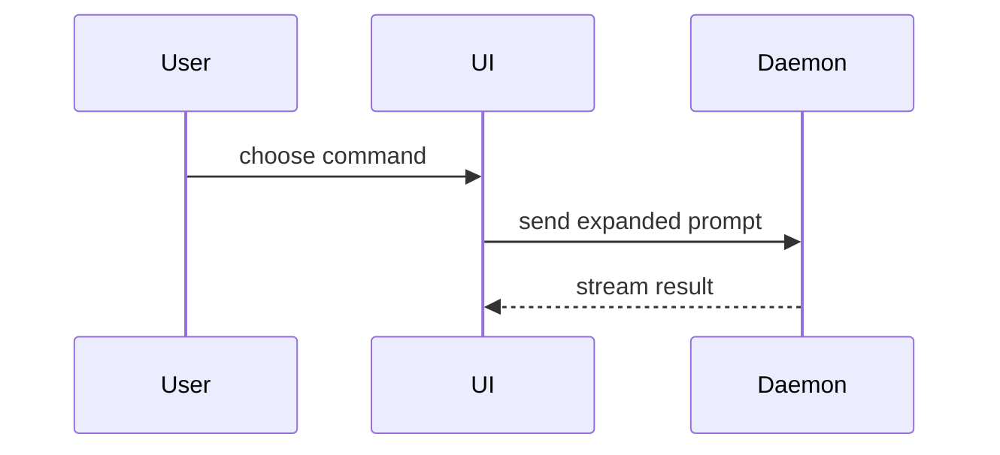

# Visual examples

Use one or more of these forms only when they clarify the current question.

## Logic

```text
on(save)
  if content is unchanged
    return cached result
  write new content
  return fresh result
```

## Runtime or ownership trees

```text
submitForm
  createSession
    persistPrompt
    launchAgent
  navigateToSession
```

```text
src/
├── commands/       # parses user actions
├── sessions/       # owns session state
└── transport/      # sends API requests
```

## Component shape

```tsx
<SessionPage> (apps/example/src/routes/session.tsx)
  useSessionEvents()
  <SessionToolbar>
    <RunSkillButton> (packages/ui)
```

## Relationship or data flow



## Diff shape

Use a diff when the surrounding shape already exists and the point is what changes.

```diff
 submitForm
   createSession
     persistPrompt
+    expandSkillMention
     launchAgent
-  navigateToSession
+  navigateToSession
+    subscribeToEvents
```

Show the complete block instead when omitted context would hide ownership, order, or the copyable target shape.
